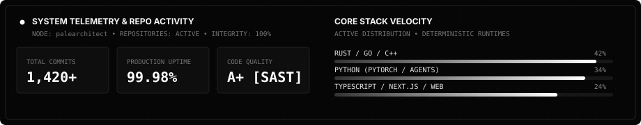
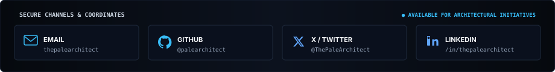

<div align="center">

<!-- Architectural Header Banner -->
<picture>
  <source media="(prefers-color-scheme: dark)" srcset="./assets/header-blueprint.svg">
  <source media="(prefers-color-scheme: light)" srcset="./assets/header-blueprint.svg">
  
</picture>

<br/>

<!-- Real-Time Status Telemetry HUD -->
<picture>
  
</picture>

<br/>

[](https://github.com/palearchitect)
[](https://github.com/palearchitect)
[](mailto:thepalearchitect@gmail.com)

</div>

<br/>

<div align="center">
  
</div>

<br/>

> **I architect and engineer resilient, high-concurrency software systems, autonomous AI agent frameworks, and low-latency cloud infrastructure.** My work bridges deterministic systems engineering (`Rust` / `Go` / `C++`) with state-of-the-art agent orchestration (`PyTorch` / `LangChain` / `LlamaIndex`), vector retrieval meshes, and modern high-performance web platforms.

<br/><br/>

<div align="center">
  
</div>

<br/><br/>

<div align="center">
  
</div>

<br/>

<details>
<summary><b>▸ Expand full inventory matrix</b></summary>
<br/>

<table>
  <tr>
    <th width="24%" align="left">LAYER</th>
    <th width="76%" align="left">DEPLOYED TECHNOLOGIES &amp; TOOLING</th>
  </tr>
  <tr>
    <td><b>Core Systems</b></td>
    <td>
      
      
      
      
      
      
    </td>
  </tr>
  <tr>
    <td><b>Agentic &amp; AI</b></td>
    <td>
      
      
      
      
      
      
    </td>
  </tr>
  <tr>
    <td><b>Web &amp; APIs</b></td>
    <td>
      
      
      
      
      
      
    </td>
  </tr>
  <tr>
    <td><b>Data &amp; Vectors</b></td>
    <td>
      
      
      
      
      
    </td>
  </tr>
  <tr>
    <td><b>Cloud &amp; Platform</b></td>
    <td>
      
      
      
      
      
      
    </td>
  </tr>
</table>

</details>

<br/><br/>

<div align="center">
  
</div>

<br/>

```rust
pub struct EngineeringPillars {
    pub autonomous_agents: AgenticFrameworks,
    pub distributed_systems: HighConcurrencyEngine,
    pub cloud_infra: ZeroTrustDevSecOps,
    pub full_stack: ModernInterfacePlatform,
}

impl EngineeringPillars {
    pub fn deploy_solution(&self) -> Result<ProductionGradeSystem, SystemError> {
        // High-density architecture with sub-millisecond execution loops
        Ok(ProductionGradeSystem::new())
    }
}
```

<br/><br/>

<div align="center">
  
  <br/><br/>
  
</div>

<br/><br/>

<div align="center">
  
  <br/><br/>
  <sub><b>THE PALE ARCHITECT</b> • STARK MONOCHROME EDITORIAL PRECISION • LATENCY OPTIMIZED • DETERMINISTIC EXCELLENCE</sub>
</div>
