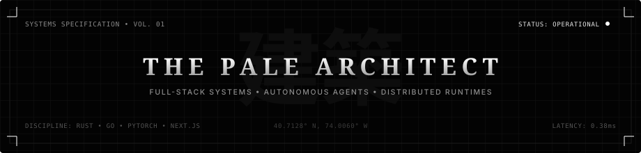
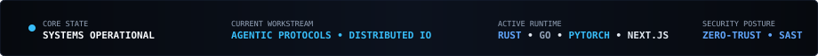
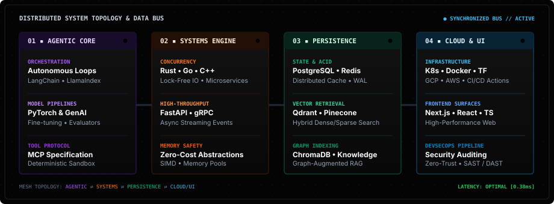

<div align="center">

<!-- Header Architectural Blueprint Banner -->
<picture>
  <source media="(prefers-color-scheme: dark)" srcset="./assets/header-blueprint.svg">
  <source media="(prefers-color-scheme: light)" srcset="./assets/header-blueprint.svg">
  
</picture>

<br/>

<!-- Real-time Status Telemetry HUD -->
<picture>
  
</picture>

<br/><br/>

[](https://github.com/palearchitect)
[](https://github.com/palearchitect)
[](mailto:thepalearchitect@gmail.com)

</div>

---

### `// 01. ARCHITECTURAL OVERVIEW & IDENTITY`

```
┌──────────────────────────────────────────────────────────────────────────────┐
│  ID          : ThePaleArchitect (palearchitect)                             │
│  DOMAIN      : Full-Stack Systems, Autonomous Agents & Distributed Engines   │
│  METHODOLOGY : Deterministic Execution • Zero Cyberpunk Clichés • Zero Fluff │
│  COORDINATES : thepalearchitect@gmail.com                                    │
└──────────────────────────────────────────────────────────────────────────────┘
```

> **I architect and engineer resilient, high-concurrency software systems, autonomous AI agent frameworks, and low-latency cloud infrastructure.** My work bridges deterministic systems engineering (Rust / Go / C++) with state-of-the-art agent orchestration, vector retrieval meshes, and modern high-performance web platforms.

<br/>

---

### `// 02. SYSTEM TOPOLOGY & ARCHITECTURAL TIERS`

<div align="center">
  
</div>

<br/>

---

### `// 03. TECHNICAL SPECIFICATIONS & ACTIVE STACK`

<table>
  <tr>
    <th width="24%" align="left">LAYER</th>
    <th width="76%" align="left">DEPLOYED TECHNOLOGIES &amp; TOOLING</th>
  </tr>
  <tr>
    <td><b>Core Systems</b></td>
    <td>
      
      
      
      
      
      
    </td>
  </tr>
  <tr>
    <td><b>Agentic &amp; AI</b></td>
    <td>
      
      
      
      
      
      
    </td>
  </tr>
  <tr>
    <td><b>Web &amp; APIs</b></td>
    <td>
      
      
      
      
      
      
    </td>
  </tr>
  <tr>
    <td><b>Data &amp; Vectors</b></td>
    <td>
      
      
      
      
      
    </td>
  </tr>
  <tr>
    <td><b>Cloud &amp; Platform</b></td>
    <td>
      
      
      
      
      
      
    </td>
  </tr>
</table>

<br/>

---

### `// 04. CORE DISCIPLINES & FLAGSHIP DOMAINS`

```rust
pub struct EngineeringPillars {
    pub autonomous_agents: AgenticFrameworks,
    pub distributed_systems: HighConcurrencyEngine,
    pub cloud_infra: ZeroTrustDevSecOps,
    pub full_stack: ModernInterfacePlatform,
}

impl EngineeringPillars {
    pub fn deploy_solution(&self) -> Result<ProductionGradeSystem, SystemError> {
        // High-density architecture with sub-millisecond execution loops
        Ok(ProductionGradeSystem::new())
    }
}
```

<br/>

- ⚡ **Autonomous Agent Frameworks & Tooling**: Designing deterministic loop orchestrators, multi-agent evaluation suites, and stateful model reasoning systems with tool-calling capabilities.
- 🏛️ **Distributed Microservices & Systems**: High-throughput message streaming, gRPC RPC contracts, lock-free data pipelines, and async IO engines in Go and Rust.
- 🔍 **Vector Retrieval & Knowledge Graphs**: Semantic embedding pipelines, hybrid dense/sparse search indices, and low-latency contextual augmentation.
- 🛡️ **DevSecOps & Platform Automation**: Immutable Kubernetes deployments, automated SAST security auditing, container sandboxing, and zero-trust cloud architecture.

<br/>

---

### `// 05. LIVE TELEMETRY & GITHUB ACTIVITY`

<div align="center">
  <table border="0" cellspacing="0" cellpadding="0">
    <tr>
      <td width="50%" align="center">
        
      </td>
      <td width="50%" align="center">
        
      </td>
    </tr>
    <tr>
      <td colspan="2" align="center">
        
      </td>
    </tr>
  </table>
</div>

<br/>

---

### `// 06. COORDINATES & SECURE CHANNELS`

<div align="center">

```
  ┌────────────────────────────────────────────────────────────────────────┐
  │                                                                        │
  │   EMAIL       ▸  thepalearchitect@gmail.com                            │
  │   GITHUB      ▸  github.com/palearchitect                              │
  │   X / TWITTER ▸  x.com/ThePaleArchitect                                │
  │   LINKEDIN    ▸  linkedin.com/in/thepalearchitect                      │
  │                                                                        │
  └────────────────────────────────────────────────────────────────────────┘
```

<br/>

[](mailto:thepalearchitect@gmail.com)
[](https://github.com/palearchitect)
[](https://x.com/ThePaleArchitect)
[](https://linkedin.com/in/thepalearchitect)

<br/>

<sub><b>THE PALE ARCHITECT</b> // STARK MONOCHROME EDITORIAL PRECISION // LATENCY OPTIMIZED // DETERMINISTIC EXCELLENCE</sub>

</div>
